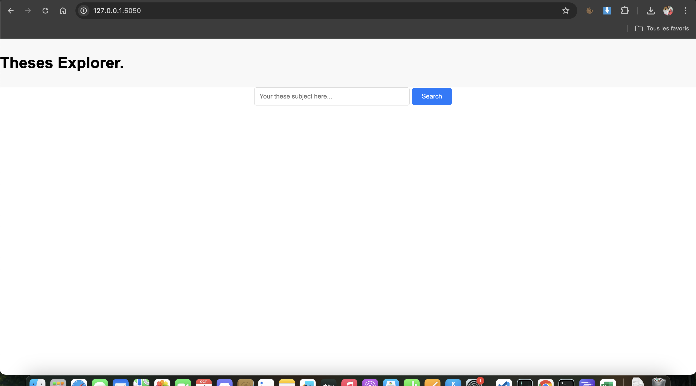
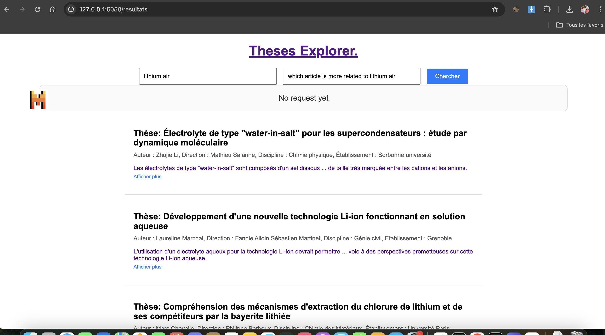
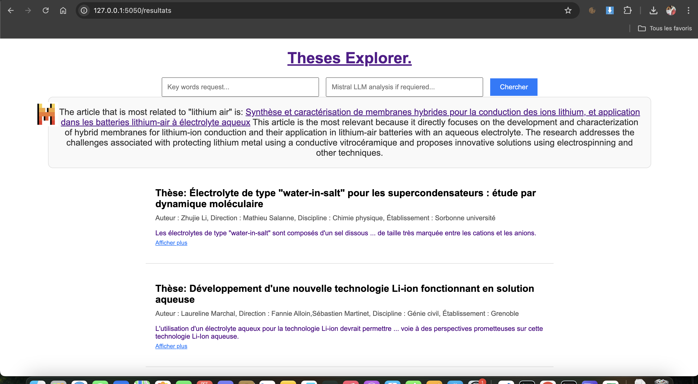
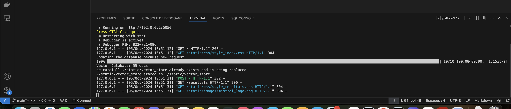
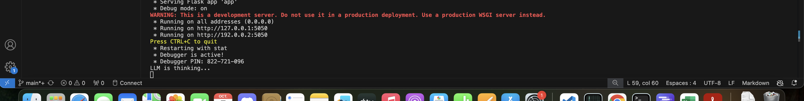

# Flask Thesis Search Application  

## Description  
This Flask application allows users to search for theses based on specific queries. It extracts data from a database and uses advanced analysis techniques to provide the most relevant results. The app is also integrated with Mistral to analyze the context of the results and give feedback based on the provided query.  

## Features  
- Search for theses by keywords.
- Update the database if the query is new.
- Display similar results based on the query.
- Option to analyze the query with Mistral.
- Supports multiple queries with context-based analysis.

### 1. Clone the repository   
`git clone https://github.com/Avicenne-ctrl/these-explorer-api.git`  

### 2. Install required dependencies  
`pip install -r requirements.txt`    

### 3. Modify the ./scripts/config.ini   
The application uses a config.ini file to manage file paths and other essential parameters. 
- Please provide in the file your personal Mistral API key if you want to use the LLM analysis functionality, by default it's None : `API_KEY = your_api_key`
- You need to addapt the google driver in the folder ./GOOGLE_DRIVER, if you have a MacOs, Windows... By default : `DRIVER_PATH_GOOGLE = ./GOOGLE_DRIVER/chromedriver-mac-arm64/chromedriver`  
- You can also change the mistral model if you want, by default : `MISTRAL_MODEL = mistral-large-latest`
- same for the embedder, by default : `MODEL_EMBEDDING = all-MiniLM-L6-v2`
- If you want more result you can modify the number after 'nb=', by default 'nb=10': `PATH_THESES_TAIL = &page=1&nb=10&tri=pertinence&domaine=theses`
- I advise you not to change the other path in the config.ini

### 4. Run the app  
`cd these-scrapping/`  
`python app.py`  

The application uses a config.ini file to manage file paths and other essential parameters. Here's an example structure for the config.ini file:

## Functionalities  
The first functionality on the main page is to search for theses related to a subject that you provide :  
  

Then you can filter these theses by key word, and if you have provided your personal API token for Mistral LLM in the ./scripts/config.ini file, you can directly ask Mistral for more information about the theses which correspond to the key word provided.
  

And here is the response of Mistral :
  

## check for loading  
There is no html loading pages for now, you can only check in the terminal:  
- Loading for the search of theses if new request: 
  
The database will be updating automaticaly

- Loading for the Mistral LLM analysis : 
  

## Raises
- One common raise can be the port of the server if it is already used, you can change it in the ./scripts/config.ini : `PORT_SERVER = 5050`. Usually it's 5000 or 5050.
- Connection error during url theses scrapping on theses.fr
